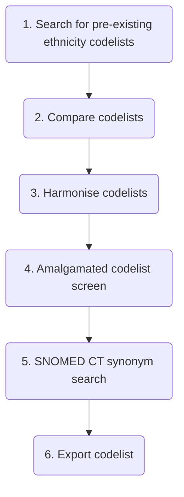
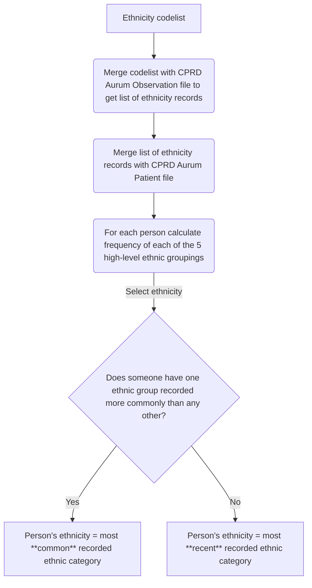

# How to retrieve ethnicity from UK primary care data

## Problem
- CPRD data = expensive
- this method = free alternative

## Ethnicity codelist creation



### 1. Search for pre-existing ethnicity codelists
| Codelist Repository                                                   | Search Strategy      | Search Results | Suitable Codelists | Clinical Terminology             | Suitable Codelist URLs                                                                                                                                                            |
| --------------------------------------------------------------------- | -------------------- | -------------- | ------------------ | -------------------------------- | --------------------------------------------------------------------------------------------------------------------------------------------------------------------------------- |
| [HDR UK Phenotype Library](https://phenotypes.healthdatagateway.org/) | "ethnicity"          | 23             | 0                  | N/A                              | N/A                                                                                                                                                                               |
| [LSHTM Data Compass](https://datacompass.lshtm.ac.uk/)                | "ethnicity codelist" | 8              | 3                  | CPRD Aurum MedCodeID (SNOMED CT) | <ol><li>https://datacompass.lshtm.ac.uk/id/eprint/2102/</li><li>https://datacompass.lshtm.ac.uk/id/eprint/2414/</li><li>https://datacompass.lshtm.ac.uk/id/eprint/4214/</li></ol> |
| [OpenCodelists](https://www.opencodelists.org/)                       | "ethnicity"          | 68             | 1                  | SNOMED CT                        | https://www.opencodelists.org/codelist/opensafely/ethnicity-snomed-0removed/2e641f61/                                                                                             |

### 2. Compare codelists
| Ethnicity codelist                                                                                               | Clinical terminology             | No. of codes | Ethnicity categories                                                                                                                                                                                                                                                                                                                                                                                                                                                                                                                                                                                                                                                                                                                                                                                                                                                        |
| ---------------------------------------------------------------------------------------------------------------- | -------------------------------- | ------------ | --------------------------------------------------------------------------------------------------------------------------------------------------------------------------------------------------------------------------------------------------------------------------------------------------------------------------------------------------------------------------------------------------------------------------------------------------------------------------------------------------------------------------------------------------------------------------------------------------------------------------------------------------------------------------------------------------------------------------------------------------------------------------------------------------------------------------------------------------------------------------- |
| [LSHTM 2102](https://datacompass.lshtm.ac.uk/id/eprint/2102/)                                                    | CPRD Aurum MedCodeID (SNOMED CT) | 263          | 5-category ethnicity:<ol><li>White</li><li>South Asian</li><li>Black</li><li>Other</li><li>Mixed</li><li>Not Stated</li></ol>16-category ethnicity:<ol><li>British</li><li>Irish</li><li>Other White</li><li>White and Black Caribbean</li><li>White and Black African</li><li>White and Asian</li><li>Other Mixed</li><li>Indian</li><li>Pakistani</li><li>Bangladeshi</li><li>Other Asian</li><li>Caribbean</li><li>African</li><li>Other Black</li><li>Chinese</li><li>Other ethnic group</li><li>Not Stated</li></ol>                                                                                                                                                                                                                                                                                                                                                   |
| [LSHTM 2414](https://datacompass.lshtm.ac.uk/id/eprint/2414/)                                                    | CPRD Aurum MedCodeID (SNOMED CT) | 263          | None provided                                                                                                                                                                                                                                                                                                                                                                                                                                                                                                                                                                                                                                                                                                                                                                                                                                                               |
| [LSHTM 4212](https://datacompass.lshtm.ac.uk/id/eprint/4214/)                                                    | CPRD Aurum MedCodeID (SNOMED CT) | 290          | 5-category ethnicity:<ol><li>White</li><li>South Asian</li><li>Black</li><li>Other</li><li>Mixed</li><li>Not Stated</li></ol>                                                                                                                                                                                                                                                                                                                                                                                                                                                                                                                                                                                                                                                                                                                                               |
| [OpenCodelists ethnicity](https://www.opencodelists.org/codelist/opensafely/ethnicity-snomed-0removed/2e641f61/) | SNOMED CT                        | 599          | 5-category ethnicity:<ol><li>White</li><li>Mixed</li><li>Asian or Asian British</li><li>Black or Black British</li><li>Chinise or Other Ethnic Groups</li></ol>16-category ethnicity:<ol><li>White: British</li><li>White: Irish</li><li>White: Any other White background</li><li>Mixed: White and Black Caribbean</li><li>Mixed: White and Black African</li><li>Mixed: White and Asian</li><li>Mixed: Any other mixed background</li><li>Asian or Asian British: Indian</li><li>Asian or Asian British: Pakistani</li><li>Asian or Asian British: Bangladeshi</li><li>Asian or Asian British: Any other Asian background</li><li>Black or Black British: Caribbean</li><li>Black or Black British: African</li><li>Black or Black British: Any other Black background</li><li>Other Ethnic Groups: Chinese</li><li>Other Ethnic Groups: Any other ethnic group</li></ol> |

The [OpenCodelists codelist](https://www.opencodelists.org/codelist/opensafely/ethnicity-snomed-0removed/2e641f61/) appears to be the most comprehensive and includes a [GitHub discussion around the included terms and justification for the classifications](https://github.com/opensafely/codelist-development/issues/126).

### 3. Harmonise codelists
- Removed "Not Stated" ethnicity category from codelists that included it as it is not useful
- Recoded the [OpenSafely codelist](https://www.opencodelists.org/codelist/opensafely/ethnicity-snomed-0removed/2e641f61/) to use the same categories as the LSHTM codelists
  ```stata
  recode eth5 (2 = 5) (3 = 2) (4 = 3) (5 = 4)
  ```
- Checked for conflicts and chose most appropriate ethnicity category

### 4. Amalgamated codelist screen
- Changed the category for 26 codes where it seemed another ethnicity category was more appropriate. See [log file](stata/ethnicity.log) for exact changes.

### 5. SNOMED CT synonym search
- Found 12 new synonymous codes
- Removed one new synoynm code for being too vague, leaving 11 new codes in total

### 6. Export codelist
- **The final codelist including the codes, terms, ethnicity category, and source of each code can be found [here](stata/ethnicity.csv).**
- Uses the [2001 Census ethnic groupings](https://www.ethnicity-facts-figures.service.gov.uk/style-guide/ethnic-groups/#2001-census):
  - 5-category ethnicity (eth5) labelled as:
    1. White
    1. South Asian
    1. Black
    1. Other
    1. Mixed
  - 16-category ethnicit (eth16) labelled as:
    1. British
    1. Irish
    1. Other White
    1. White and Black Caribbean
    1. White and Black African
    1. White and Asian
    1. Other Mixed
    1. Indian
    1. Pakistani
    1. Bangladeshi
    1. Other Asian
    1. Caribbean
    1. African
    1. Other Black
    1. Chinese
    1. Other ethnic group
- Stata do file to create the ethnicity codelist can be found [here](stata/ethnicity.do).


## Ethnicity codelist use



1. First merge the [ethnicity codelist](stata/ethnicity.csv) with the CPRD Aurum Observation file and keep all resulting matches to generate a long file of all ethnicity codes for patients in your cohort.
2. Merge the long file of all ethnicity codes with the CPRD Aurum Patient file, keeping matches.
3. Determine most commonly recorded ethnic category for each individual with *no limitation* on date (can be recorded in past or future).
4. If an individual has 2 or more ethnic groups recorded with the same frequency, the most recently recorded ethnicity (of the most frequently recorded ethnic groups) is chosen, otherwise the most commonly recorded ethnicity is selected as the persons ethicity.
5. If an individual has two equally common ethnic groups recorded on the same day, of those ethnicities the most frequently recorded one in the 2021 England and Wales census is selected  (should be the same as [CPRD's method](https://www.cprd.com/sites/default/files/2025-09/CPRD_EthnicityRecord_Documentation_v1.2.pdf)).

### Considerations
- Uses all data available for a patient, therefore may end up looking into the future relative to study period.

### Differences from [CPRD's algorithm](https://www.cprd.com/sites/default/files/2025-09/CPRD_EthnicityRecord_Documentation_v1.2.pdf)
- No HES data (primary care data only)
- Different codelist (I am guessing [this](https://static-content.springer.com/esm/art%3A10.1186%2Fs12963-023-00302-0/MediaObjects/12963_2023_302_MOESM3_ESM.docx) is CPRD's codelist (from [Shiekh et al., 2023](https://doi.org/10.1186/s12963-023-00302-0)) but categorisation is not included)
- CPRD choose the second most commonly recorded ethnic group if "Other" is the most frequently recorded ethnic group. I have not done this because I don't think it is a reasonable thing to do at all.

### Implications of algorithm
- mention about timeframe (all data used)
- will need to think about how to use variable dependent on whether exposure or covariate, esp wrt missing data

### Data completeness
Ethnicity completeness was >80% for a cohort of people with severe mentall illness and a cohort of people with dementia

### Example Stata code
Do file available [here](stata/ethnicity_algorithm.do).
```stata
use 1b_formatted_data/Patient, clear

preserve
	keep pracid patid
	merge 1:m pracid patid using 3_builds/eth5  //all ethnicity codes in Observation file
	keep if _merge == 3
	drop _merge medcodeid

	gsort pracid patid eth5_date

	label list eth5
	drop if eth5 == 6  //"Not stated" isn't useful
	generate byte white = 1 if eth5 == 1
	generate byte south_asian = 1 if eth5 == 2
	generate byte black = 1 if eth5 == 3
	generate byte other = 1 if eth5 == 4
	generate byte mixed = 1 if eth5 == 5

	//Date of most recent code for each ethnicity category
	by pracid patid: egen white_recent = max(eth5_date) if white == 1
	by pracid patid: egen south_asian_recent = max(eth5_date) if south_asian == 1
	by pracid patid: egen black_recent = max(eth5_date) if black == 1
	by pracid patid: egen other_recent = max(eth5_date) if other == 1
	by pracid patid: egen mixed_recent = max(eth5_date) if mixed == 1
	format %td *_recent

	collapse (sum) white_count = white ///
			south_asian_count = south_asian ///
			black_count = black ///
			other_count = other ///
			mixed_count = mixed ///
		(max) white_recent south_asian_recent black_recent other_recent mixed_recent, ///
		by(pracid patid)
		
	reshape long @count @recent, i(pracid patid) j(eth) string

	//Make a new ethnicity variable
	//The order below ensures most common category from census is
	//used in case of two categories being equally common and recorded on same day
	generate byte ethnicity = .
	label define ethnicity 1 "White" 2 "South Asian" 3 "Black" 4 "Mixed" 5 "Other"
	label values ethnicity ethnicity
	replace ethnicity = 1 if eth == "white_"
	replace ethnicity = 2 if eth == "south_asian_"
	replace ethnicity = 3 if eth == "black_"
	replace ethnicity = 4 if eth == "mixed_"
	replace ethnicity = 5 if eth == "other_"
	tab ethnicity eth, missing
	drop eth

	gsort pracid patid -count -recent ethnicity

	by pracid patid: keep if _n == 1

	keep pracid patid ethnicity
	tempfile ethnicity
	save `ethnicity'
restore
merge 1:1 pracid patid using `ethnicity', nogenerate
recode ethnicity (. = 99)
label define ethnicity 99 "Missing", add
tab ethnicity, missing
```
