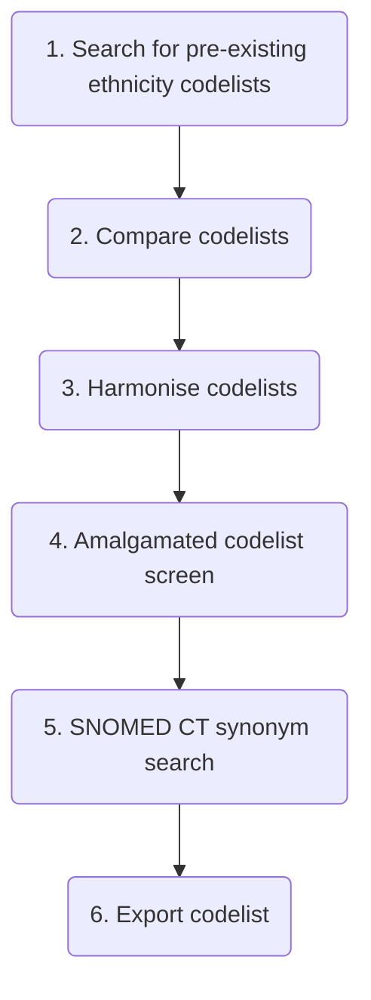

# How to retrieve ethnicity from UK primary care data

## Codelist creation



### 1. Search for pre-existing ethnicity codelists
| Codelist Repository                                                   | Search Strategy      | Search Results | Suitable Codelists | Clinical Terminology             | Suitable Codelist URLs                                                                                                                                                            |
| --------------------------------------------------------------------- | -------------------- | -------------- | ------------------ | -------------------------------- | --------------------------------------------------------------------------------------------------------------------------------------------------------------------------------- |
| [HDR UK Phenotype Library](https://phenotypes.healthdatagateway.org/) | "ethnicity"          | 23             | 0                  | N/A                              | N/A                                                                                                                                                                               |
| [LSHTM Data Compass](https://datacompass.lshtm.ac.uk/)                | "ethnicity codelist" | 8              | 3                  | CPRD Aurum MedCodeID (SNOMED CT) | <ol><li>https://datacompass.lshtm.ac.uk/id/eprint/2102/</li><li>https://datacompass.lshtm.ac.uk/id/eprint/2414/</li><li>https://datacompass.lshtm.ac.uk/id/eprint/4214/</li></ol> |
| [OpenCodelists](https://www.opencodelists.org/)                       | "ethnicity"          | 68             | 1                  | SNOMED CT                        | https://www.opencodelists.org/codelist/opensafely/ethnicity-snomed-0removed/2e641f61/                                                                                             |

### 2. Compare codelists
| Ethnicity codelist                                                                                               | Clinical terminology             | No. of codes | Ethnicity categories                                                                                                                                                                                                                                                                                                                                                                                                                                                                                                                                                                                                                                                                                                                                                                                                                                                        |
| ---------------------------------------------------------------------------------------------------------------- | -------------------------------- | ------------ | --------------------------------------------------------------------------------------------------------------------------------------------------------------------------------------------------------------------------------------------------------------------------------------------------------------------------------------------------------------------------------------------------------------------------------------------------------------------------------------------------------------------------------------------------------------------------------------------------------------------------------------------------------------------------------------------------------------------------------------------------------------------------------------------------------------------------------------------------------------------------- |
| [LSHTM 2102](https://datacompass.lshtm.ac.uk/id/eprint/2102/)                                                    | CPRD Aurum MedCodeID (SNOMED CT) | 263          | 5-category ethnicity:<ol><li>White</li><li>South Asian</li><li>Black</li><li>Other</li><li>Mixed</li><li>Not Stated</li></ol>16-category ethnicity:<ol><li>British</li><li>Irish</li><li>Other White</li><li>White and Black Caribbean</li><li>White and Black African</li><li>White and Asian</li><li>Other Mixed</li><li>Indian</li><li>Pakistani</li><li>Bangladeshi</li><li>Other Asian</li><li>Caribbean</li><li>African</li><li>Other Black</li><li>Chinese</li><li>Other ethnic group</li><li>Not Stated</li></ol>                                                                                                                                                                                                                                                                                                                                                   |
| [LSHTM 2414](https://datacompass.lshtm.ac.uk/id/eprint/2414/)                                                    | CPRD Aurum MedCodeID (SNOMED CT) | 263          | None provided                                                                                                                                                                                                                                                                                                                                                                                                                                                                                                                                                                                                                                                                                                                                                                                                                                                               |
| [LSHTM 4212](https://datacompass.lshtm.ac.uk/id/eprint/4214/)                                                    | CPRD Aurum MedCodeID (SNOMED CT) | 290          | 5-category ethnicity:<ol><li>White</li><li>South Asian</li><li>Black</li><li>Other</li><li>Mixed</li><li>Not Stated</li></ol>                                                                                                                                                                                                                                                                                                                                                                                                                                                                                                                                                                                                                                                                                                                                               |
| [OpenCodelists ethnicity](https://www.opencodelists.org/codelist/opensafely/ethnicity-snomed-0removed/2e641f61/) | SNOMED CT                        | 599          | 5-category ethnicity:<ol><li>White</li><li>Mixed</li><li>Asian or Asian British</li><li>Black or Black British</li><li>Chinise or Other Ethnic Groups</li></ol>16-category ethnicity:<ol><li>White: British</li><li>White: Irish</li><li>White: Any other White background</li><li>Mixed: White and Black Caribbean</li><li>Mixed: White and Black African</li><li>Mixed: White and Asian</li><li>Mixed: Any other mixed background</li><li>Asian or Asian British: Indian</li><li>Asian or Asian British: Pakistani</li><li>Asian or Asian British: Bangladeshi</li><li>Asian or Asian British: Any other Asian background</li><li>Black or Black British: Caribbean</li><li>Black or Black British: African</li><li>Black or Black British: Any other Black background</li><li>Other Ethnic Groups: Chinese</li><li>Other Ethnic Groups: Any other ethnic group</li></ol> |

The [OpenCodelists codelist](https://www.opencodelists.org/codelist/opensafely/ethnicity-snomed-0removed/2e641f61/) appears to be the most comprehensive and includes a [GitHub discussion around the included terms and justification for the classifications](https://github.com/opensafely/codelist-development/issues/126).

### 3. Harmonise codelists
- Removed "Not Stated" ethnicity category from codelists that included it as it is not useful
- Recoded the [OpenSafely codelist](https://www.opencodelists.org/codelist/opensafely/ethnicity-snomed-0removed/2e641f61/) to use the same categories as the LSHTM codelists
  ```stata
  recode eth5 (2 = 5) (3 = 2) (4 = 3) (5 = 4)
  ```
- Checked for conflicts and chose most appropriate ethnicity category

### 4. Amalgamated codelist screen
- Changed the category for 26 codes where it seemed another ethnicity category was more appropriate. See [log file](stata/ethnicity.log) for exact changes.

### 5. SNOMED CT synonym search
- Found 12 new synonymous codes
- Removed one new synoynm code for being too vague, leaving 11 new codes in total

### 6. Export codelist
- **The final codelist including the codes, terms, ethnicity category, and source of each code can be found [here](stata/ethnicity.csv).**

## Codelist use
